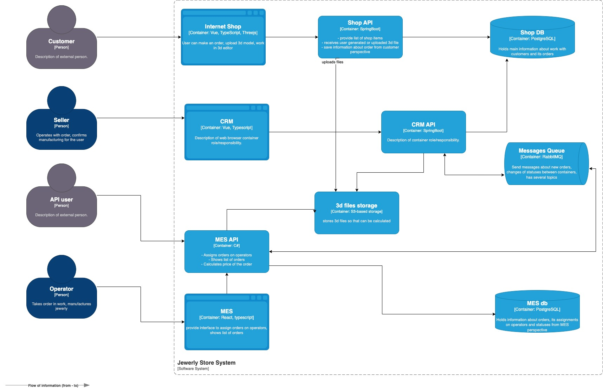

текущая архитектура

1. Cуществующие проблемы :
    1. Долгий просчет стоимости 3d модели.
    2. Высокая нагрузка - много заказов.
    3. Заказ долго доходит до производства.
    4. Жалобы со стороны пользователей API.
    5. Жалобы от операторов: когда они заходят на первую страницу MES, система долго прогружается.
    6. После открытия API компания потеряла уже несколько крупных контрактов из-за проблем с заказами.
    7. Недовольство клиентов онлайн-магазина (B2C) растёт из за неполучения заказов.
    8. Описание некоторых контейнеров на схеме не совсем корректно.
    9. Используются не все возможности облаков.
    10. Мало окружений.
    11. Нет автоматизации release окружения.
    12. Мало сотрудников QA. Мало автоматизации при тестировании. Простои в доведении изменений до прода.
    13. Нет кэширований, нет мониторингов, логгирования. За продом никто не следит.
    14. Статусы заказа говорят что процесс заказа выглядит синхронно - ждем пока подсчитается стоимость.
2. Инициативы (в порядке приоритета)
    1. Создание и согласование с бизнесом:
        1. критических метрик,
        2. найм новых тестеров тк нужно ускорять доведение изменений
        3. найм devops тк возрастет нагрузка на текущего
        4. найм sre для поиска узких мест и слежения за критическими ситуациями с продакшеном
        5. найм support для обработки и решения проблем пользователей.
    2. Внедрение процессов наблюдения за продакшеном, чтобы выявить узкие места:
        1. Мониторинг
        2. Логирование
        3. Трейсирование
        4. Уведомления
    3. Улучшение интерфейса MES:
        1. Оптимизировать интерфейс MES для более быстрой загрузки и удобства использования. Стоит рассмотреть внедрение
           более эффективных методов кэширования данных и оптимизации запросов к базе данных. Вынести подсчет стоимости
           моделей в отдельный сервис.
    4. Увеличение ресурсов:
        1. Рассмотреть возможность масштабирования серверов и баз данных, чтобы справиться с увеличенной нагрузкой. Это
           может
           включать в себя увеличение инстансов \ использование других технологий в облаке или увеличение характеристик
           у
           виртаулок в облаке.
    5. Оптимизация взаимодействия сервисов:
        1. Стоит задуматься о внедрении gateway api.
        2. Стоит задуматься о внедрения микрофронтендов.
        3. Стоит задуматься о внедрении CQRS.
    6. Модернизация процессов:
        1. Внедрить сервисы для отслеживания статуса заказов и уведомления клиентов.
        2. Добавить новые шаги в процесс заказа - Заказ создан. Заказ принят для подсчета стоимости. Подтвердите
           стоимость заказа.

3. Какой вы видите целевую архитектуру через полгода?
   Продакшен будет польностью наблюдаем. Будут выявлены узкие места. Все что можно закешировать - закешируем. Будет
   больше асинхронного взаидойствия через очереди. Некоторые сервисы будут разделены на несколько. Будет внедрен gateway
   api, cqrs, backpressure.

4. Возможность выполнить только три пункта:
    1. Внедрение процессов наблюдения за продакшеном, чтобы выявить узкие места:
        1. Мониторинг
        2. Логирование
        3. Трейсирование
        4. Уведомления
    2. Улучшение взаимодействия операторов с MES:
        1. Оптимизировать интерфейс MES для более быстрой загрузки и удобства использования. Внедрение
           более эффективных методов кэширования данных и оптимизации запросов к базе данных. Вынести подсчет стоимости
           моделей в отдельный сервис.
    3. Увеличение ресурсов:
        1. Рассмотреть возможность масштабирования серверов и баз данных, чтобы справиться с увеличенной нагрузкой. Это
           может включать в себя увеличение инстансов \ использование других технологий в облаке или увеличение
           характеристик у виртаулок в облаке.
выбрал эти пункты, потому что с точки зрения затраты ресурсов и получения бизнес профита - это наиболее
эффективные и наименее затратные способы найти проблемы и получить ускорение доведения заказов до операторов,
Что поможет более эффективно использовать текущий, не весь используемый потенциал производства.   

